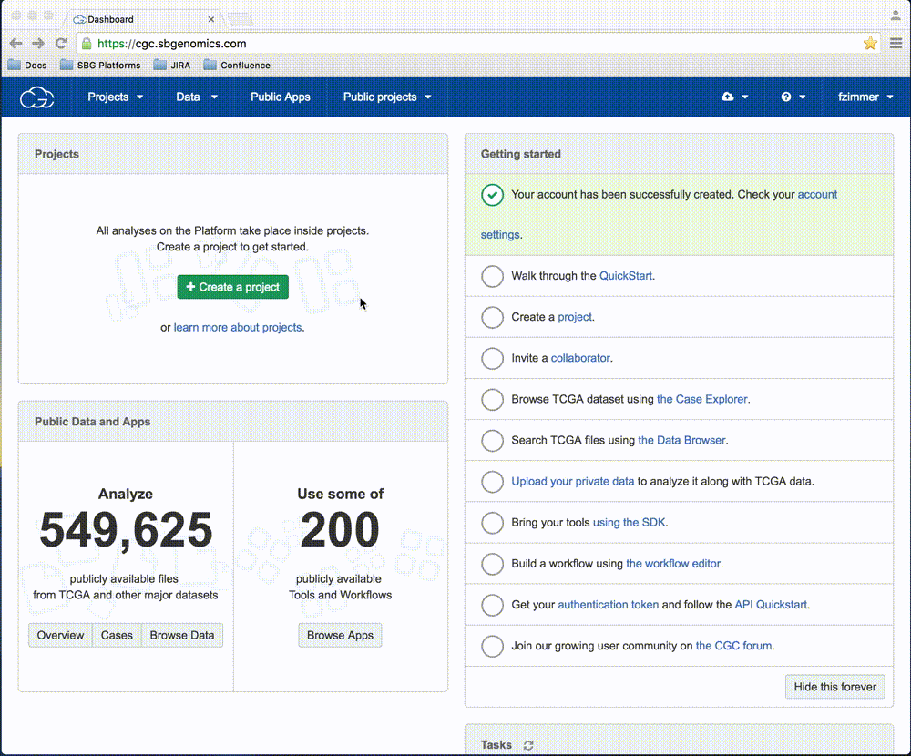
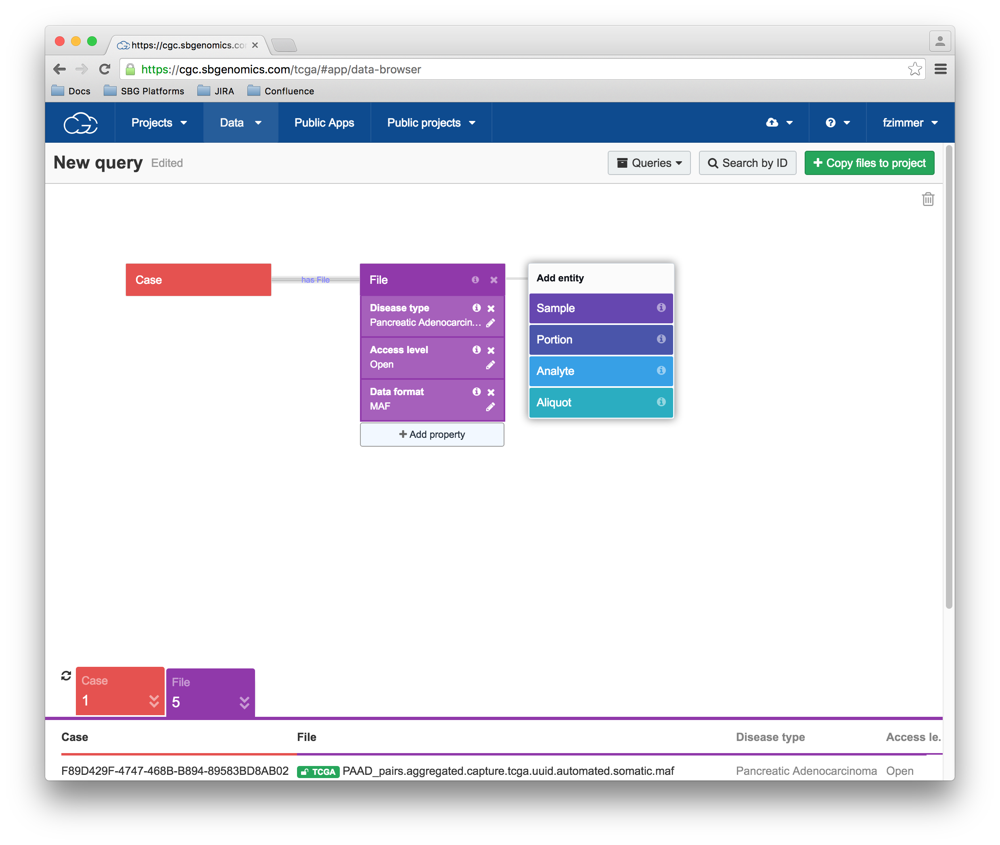

# Visualizing MAF file from the TCGA data

## Objectives:

- Select MAF files from the Pancreatic Adenocarcinoma
- Use MafTools to visualize the MAF file

All this will be done using the [Cancer Genomics Cloud](https://cgc.sbgenomics.com/) (CGC for short.)

# Overview video

# Step-by-step instructions

## Selecting a case

## Selecting Disease

## Selecting Pancreatic Adenocarcinoma

## Selecting open access files

## Selecting data format

## The final query results

# Import the CWL description of the tool

To import the CWL on your project, Go on the `Apps` and click on `add new tool`.
Then click on Import Json, and import from URL: https://raw.githubusercontent.com/sbg/maftools/cwl-desciption/maftools.cwl.json

# Plots produced by the visualizeMaf application

After the application is launched, you can expect two main outputs:

- [SummaryPlot](https://github.com/sbg/icr-workshop/blob/master/img/example_summaryPlot.pdf)
- [OncoPlot and TiTv](https://github.com/sbg/icr-workshop/blob/master/img/example_oncoplot_and_titv.pdf)

