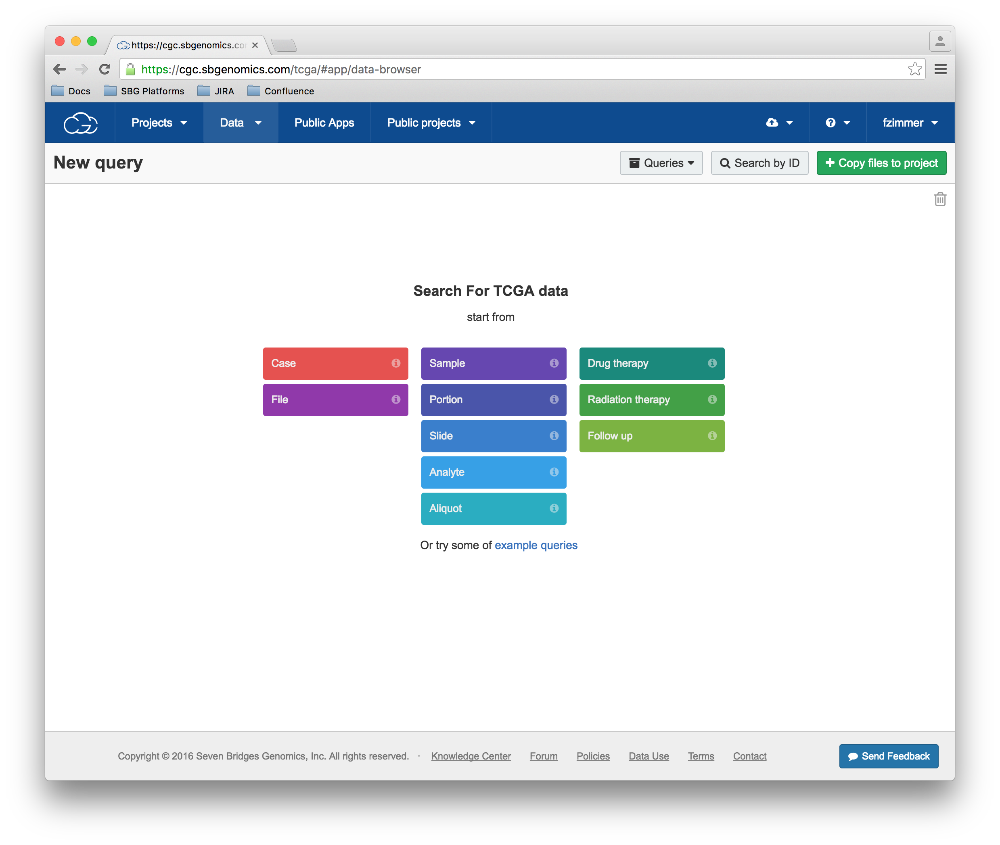
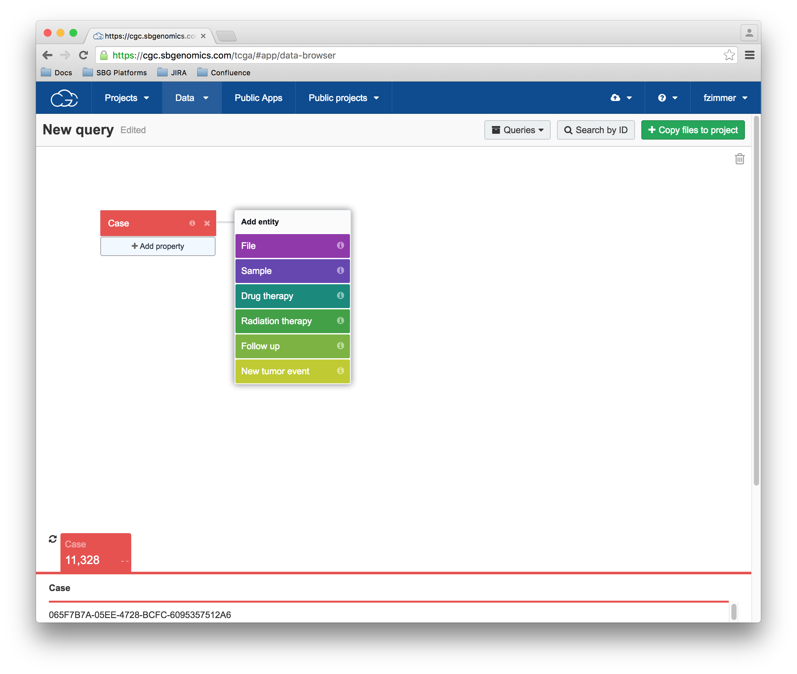
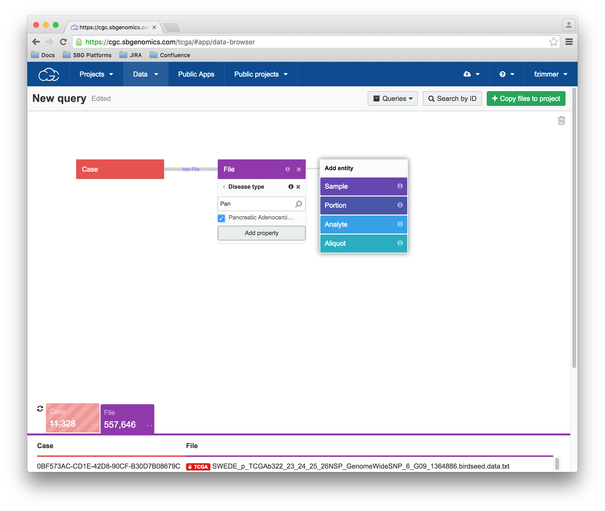
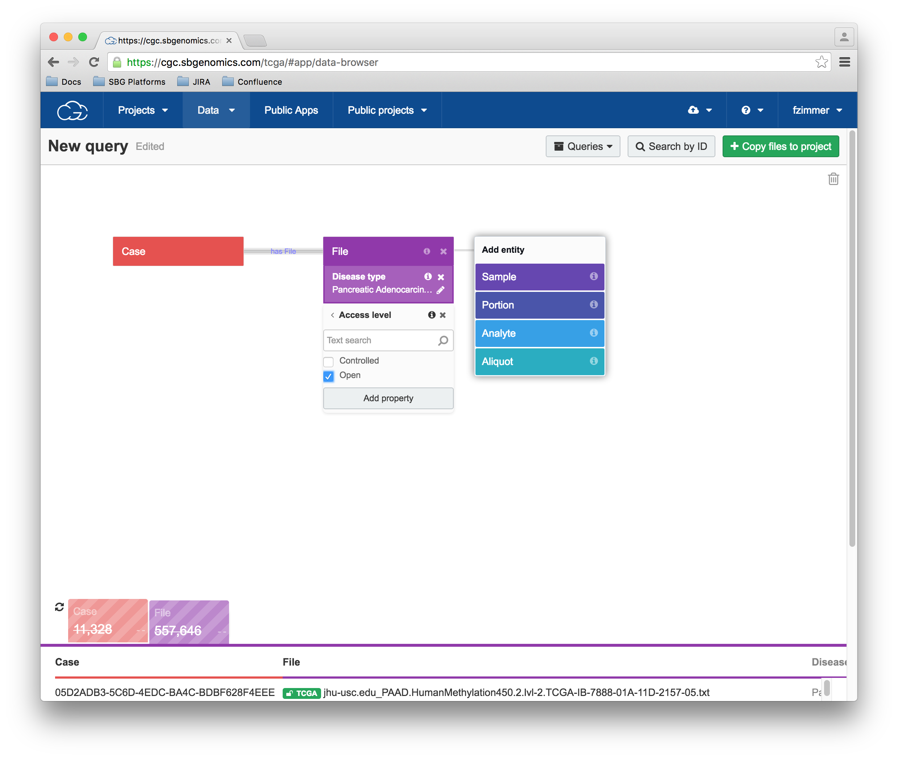
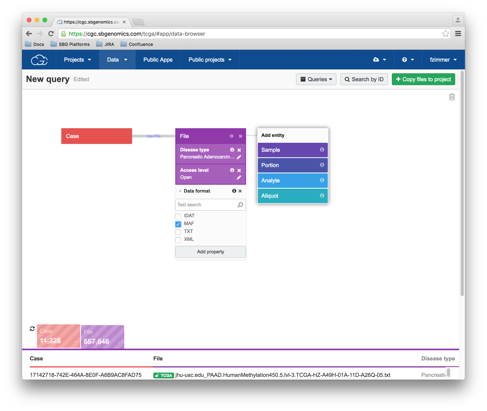
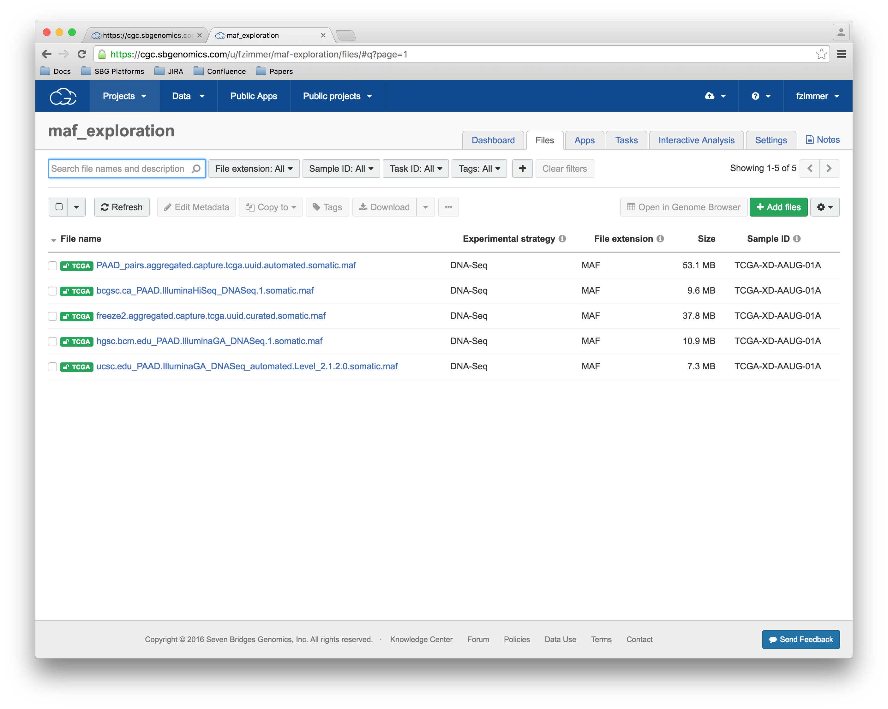

# Visualizing MAF files from TCGA data

The [Mutation Annotation Format (MAF)](http://www.broadinstitute.org/igv/MutationAnnotationFormat) is used by the TCGA project to annotate somatic mutations (e.g. missense or frameshift mutations) in different types of cancer.
In order to visualize these data, we use [maftools](http://poisonalien.github.io/). [maftools](http://poisonalien.github.io/) provides both summarizing statistics and various plots
to get an overview of the data. In this tutorial you will learn how to access MAF files from the Pancreatic Adenocarcinoma, add them to a project on the [Cancer Genomics Cloud](https://cgc.sbgenomics.com/) (CGC for short), run [maftools](http://poisonalien.github.io/) and visualize some results.

## Objectives:

- Select MAF files from the Pancreatic Adenocarcinoma
- Import the files into your project
- Use maftools to visualize the MAF file

# 1. How to query TGCA data

The CGC platform allows you to query the TGCA dataset in an easy and visual way. This short video illustrates how to select a subset of cases based on a combination of different critera. Here we select case files:

- with a diagnosis of Pancreatic Adenocarcinoma (`Disease type`)
- that are open access (`Access level`)
- in the MAF format (`Data format`)

# Step-by-step instructions

## The TCGA search interface

This is the search interface for all the TCGA data available on the CGC platform.

## Selecting a case

Here, please select the red `Case` category.

## Selecting Disease

After selecting the `Case category`, please click on the purple `File` category to add properties to the query. In a first step, please select the "Disease type" category and search for Pancreatic Adenocarcinoma

## Selecting Pancreatic Adenocarcinoma
Tick the Pancreatic Adenoncarcinoma box and click the `Add property` button.

## Selecting open access files
Please select the `Access level` property and then select `open`

## Selecting data format
Please select the `Data format` property and then select `MAF`

## The final query results

This is the finished query:

# 2. Import the files into a project

After selecting files, we add the files to our project called `maf_exploration`

## Add files to the project

In order to add the files to our project, please click the green `+ Copy files to project` button in the upper right corner. Then select your project by name.

## Imported files in project
Files are listed in the `Files` tab in the `maf_exploration` project

# 3. Import Maftools

In this step, you will run [maftools](http://poisonalien.github.io/) to produce some summary statistics and plots for the input MAF files.

## Import the CWL description of the tool

To import the CWL on your project, Go on the `Apps` and click on `+ Add app`. Then click the green `Create Tool` button, enter the name "maftools" in the dialog and click `create`.
Then select the button right next to run shown three dots on the top right. A menu opens and click on Import Json, and import from URL: https://raw.githubusercontent.com/sbg/maftools/cwl-desciption/maftools.cwl.json

# 4. Run Maftools

TBD

# Plots produced by the visualizeMaf application

After the application is launched, you can expect two main outputs:

- [SummaryPlot](https://github.com/sbg/icr-workshop/blob/master/img/example_summaryPlot.pdf)
- [OncoPlot and TiTv](https://github.com/sbg/icr-workshop/blob/master/img/example_oncoplot_and_titv.pdf)

